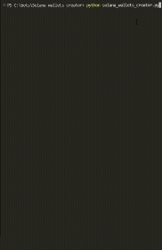

# Solana Multi-Wallet Manager

**Create wallets, check balances, and send SOL — entirely on your own machine. No bots, no third parties, no trust required.**



Stop relying on sketchy online bots or web tools that ask for your private keys.
This tool runs 100% locally: your keys never leave your computer, no external service ever touches them.
Everything happens directly between your machine and the Solana blockchain.

---

## Features

- **AI agent integration** — plug directly into Claude Code or OpenClaw via MCP and control everything through natural language chat
- **Bulk wallet generation** — create any number of Solana wallets instantly
- **Live balance display** — fetch real-time SOL balances for all wallets at once
- **View private keys** — display any wallet's private key for import into Phantom, Solflare, etc.
- **Bulk send** — send SOL from all wallets or a selected subset in one command
- **Manual send** — enter a custom amount per wallet interactively
- **Network switching** — toggle between Mainnet and Devnet at runtime
- **JSON export** — export all wallets and keys to a file for backup


---

## AI Agent Integration (MCP)

The included `solana_mcp.py` turns this tool into an **MCP server** that any compatible AI agent can use as a skill.
Once connected, you can simply type in the chat:

> *"Create 10 wallets"*
> *"What's the balance on wallet 3?"*
> *"Send 0.01 SOL from all wallets to address ABC..."*
> *"Send 0.05 SOL from wallets 1, 3, and 5 to address XYZ..."*
> *"Show me the private key of wallet 2"*
> *"Show private keys of all wallets"*
> *"Export all wallets to a file"*

The AI agent calls the appropriate tool automatically — no command memorization needed.

### Setting up with Claude Desktop (recommended)

1. Install the MCP SDK:
   ```bash
   pip install mcp
   ```

2. Edit `%APPDATA%\Claude\claude_desktop_config.json`:
   ```json
   {
     "mcpServers": {
       "solana": {
         "command": "C:/Users/Users/AppData/Local/Programs/Python/Python310/python.exe",
         "args": ["C:/bots/Solana wallets creator/solana_mcp.py"]
       }
     }
   }
   ```
   > **Important:** use the full path to `python.exe` — not just `python`.
   > If you installed Python elsewhere, find the path by running `python -c "import sys; print(sys.executable)"` in a terminal.

3. Restart Claude Desktop. The Solana tools will appear automatically.

### Setting up with OpenClaw

Point OpenClaw to `solana_mcp.py` as an MCP skill using the same config format above, or run `solana_wallets_creator.py` directly as a terminal-based skill.

---

## Installation

```bash
pip install solana solders base58
```

> For AI agent mode, also install:
> ```bash
> pip install mcp
> ```

---

## Usage

### Interactive mode 

```bash
python solana_wallets_creator.py
```

```
solana> create 10
solana> list
solana> show_key 3
solana> send_all ADDRESS 0.01
solana> send_selected ADDRESS 0.05 1,3,5
solana> show_all_keys
solana> export
solana> rpc devnet
solana> help
solana> quit
```

### One-shot CLI mode

```bash
python solana_wallets_creator.py create 10
python solana_wallets_creator.py list
python solana_wallets_creator.py show_key 3
python solana_wallets_creator.py send_all <ADDRESS> 0.01
python solana_wallets_creator.py send_selected <ADDRESS> 0.05 1,3,5
python solana_wallets_creator.py export
```

---

## Command Reference

| Command | Description |
|---|---|
| `create <N>` | Generate N new Solana wallets |
| `list` | Show all wallets with live balances |
| `balance <pubkey>` | Check balance of any Solana address |
| `show_key <N>` | Show public + private key of wallet #N |
| `show_all_keys` | Show keys of all wallets |
| `send_all <addr> <amount>` | Send SOL from every wallet |
| `send_selected <addr> <amount> <1,2,3>` | Send from specific wallets |
| `send_manual <addr>` | Enter send amount per wallet manually |
| `export [filepath]` | Export wallets to JSON |
| `delete_all` | Delete all wallets from local storage |
| `rpc <mainnet\|devnet\|url>` | Switch RPC endpoint |
| `help` | Show command list |
| `quit` | Exit |

---

## Security

- **Your private keys never leave your machine.** All wallet data is stored in `wallets.json` in the project folder.
- Add `wallets.json` and `wallets.export.json` to `.gitignore` — never commit private keys to a repository.
- The private key displayed by `show_key` is in **base58 format**, compatible with Phantom, Solflare, and other Solana wallets.
- By default the tool connects to **Mainnet**. Switch to Devnet for testing with `rpc devnet`.

---

## File Structure

```
solana_wallets_creator.py   # Main CLI tool and wallet manager
solana_mcp.py               # MCP server for AI agent integration
wallets.json                # Auto-generated wallet storage (add to .gitignore)
```

---

## Requirements

- Python 3.10+
- `solana` — Solana Python SDK
- `solders` — Rust-backed Solana types
- `base58` — key encoding
- `mcp` *(optional)* — for AI agent integration
